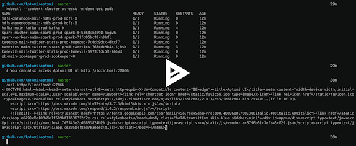
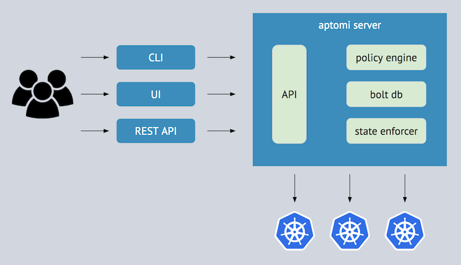

&url=https://github.com/Aptomi/aptomi&via=_aptomi&hashtags=kubernetes,docker,go,containers,microservices,helm,ops,dev,devops,cicd,continuousdelivery,software)

[Aptomi](http://aptomi.io) is a platform for development teams that simplifies roll-out and operation of container-based applications on **Kubernetes**. It introduces a service-centric abstraction, which allows to compose applications from multiple components connected together. It supports components packaged using Helm, ksonnet, k8s YAMLs or any other Kubernetes-friendly way.

Aptomi's approach to **application delivery** becomes especially powerful in a **multi-team** setup, where components owned by different teams must be put together into a service. With ownership boundaries, Dev teams can specify **multi-cluster** and **multi-env** (e.g. dev, stage, prod) service behavior, as well as control lifecycle and updates of their respective services.

It also provides contextual **visibility** into teams and services, allowing to visualize dependencies and impact of changes. 

## Demo

### Short demo (5 minutes, Asciinema)

### Detailed demo (13 minutes, Youtube)

### Asciinema Demos
* Aptomi: installation - https://asciinema.org/a/163250
* Aptomi: point to Kubernetes cluster - https://asciinema.org/a/163252
* Aptomi: defining & running applications - https://asciinema.org/a/163258
* Aptomi: updating a service instance - https://asciinema.org/a/163262
* Aptomi: deleting service instances - https://asciinema.org/a/163269

## Table of contents
<!-- START doctoc generated TOC please keep comment here to allow auto update -->
<!-- DON'T EDIT THIS SECTION, INSTEAD RE-RUN doctoc TO UPDATE -->

- [Why Aptomi](#why-aptomi)
- [Quickstart](#quickstart)
  - [Step #1: Installation](#step-1-installation)
  - [Step #2: Setting up k8s Cluster](#step-2-setting-up-k8s-cluster)
  - [Step #3: Running Examples](#step-3-running-examples)
  - [Step #4: Send us a note on Slack](#step-4-send-us-a-note-on-slack)
- [How It Works](#how-it-works)
  - [Architecture](#architecture)
  - [Language](#language)
- [How to contribute](#how-to-contribute)
- [Roadmap](#roadmap)

<!-- END doctoc generated TOC please keep comment here to allow auto update -->

## Why Aptomi

* Why would I want to use Aptomi [as a Developer](docs/benefits.md#for-developers)
* Why would I want to use Aptomi [as an Operator](docs/benefits.md#for-operators)
* How does Aptomi fit into [CI/CD model with Spinnaker/Jenkins](docs/benefits.md#how-aptomi-fits-into-cicd-jenkins-spinnaker)
* Why would I want to use Aptomi [if I'm already implementing Kubernetes/OpenShift](docs/benefits.md#why-would-i-want-to-use-aptomi-if-im-already-implementing-kubernetesopenshift)

## Quickstart

### Step #1: Installation
There are several ways to install Aptomi. The simplest one is **Compact**, but you may pick one that suits your needs:

Installation Mode     | Complexity | Description
----------------------|------------|-------------
[Compact](docs/install_compact.md) | Easy | Aptomi will be installed on a local machine (binaries or in a single Docker container)
[Kubernetes](docs/install_kubernetes.md) | Medium | Aptomi will be deployed on k8s via Helm chart

You can also install it in a stripped-down mode with fake executor:

Installation Mode     | Complexity | Description
----------------------|------------|-------------
[Concepts](docs/install_concepts.md) | Easy | Use this only if you want get familiar with Aptomi concepts, API and UI. App deployment to k8s is **DISABLED**

### Step #2: Setting up k8s Cluster

You need to have access a k8s cluster to deploy apps from the provided examples.

Having a powerful k8s cluster with good internet connection will definitely provide *better experience* compared to a local single-node k8s cluster. We consider GKE as the best option if you don't have your own k8s cluster.

Kubernetes Cluster | When to use     | How to run
------------|-----------------|-----------
Your own    | If you already have k8s cluster set up | [Configure Aptomi to use an existing k8s cluster](docs/k8s_own.md)
Google Kubernetes Engine | Useful if you have a new Google account and free credits | [Configure Aptomi to use GKE](docs/k8s_gke.md)
k8s / Minikube | Single-node, local machine with 16GB+ RAM | [Configure Aptomi to use Minikube](docs/k8s_minikube.md)
k8s / Docker For Mac | Single-node, local machine with 16GB+ RAM | [Configure Aptomi to use Docker For Mac](docs/k8s_docker_for_mac.md)

### Step #3: Running Examples

Once Aptomi server is up and k8s cluster is ready, you can get started by running the following examples:

Example    | Description
-----------|------------
[twitter-analytics](examples/twitter-analytics) | Twitter Analytics Application, multiple services, multi-cloud

### Step #4: Send us a note on Slack

Let us know your feedback on #general in . If you ran into issues, we will help get them resolved. 

## How It Works

### Architecture
 

See [artchitecture documentation](docs/architecture.md)

### Language

See [language documentation](docs/language.md)

## How to contribute
The very least you can do is to [report a bug](https://github.com/Aptomi/aptomi/issues)!

If you want to make a pull request for a bug fix or contribute a feature, see our [Development Guide](docs/dev_guide.md) for how to develop, run and test your code.

We are always looking for feedback on how to make Aptomi better. Join our Slack to discuss .

## Roadmap
[Feature Backlog](https://github.com/Aptomi/aptomi/milestone/11), as well as weekly project milestones, are good places to look at the roadmap items.

If you have any questions, please contact us on .
