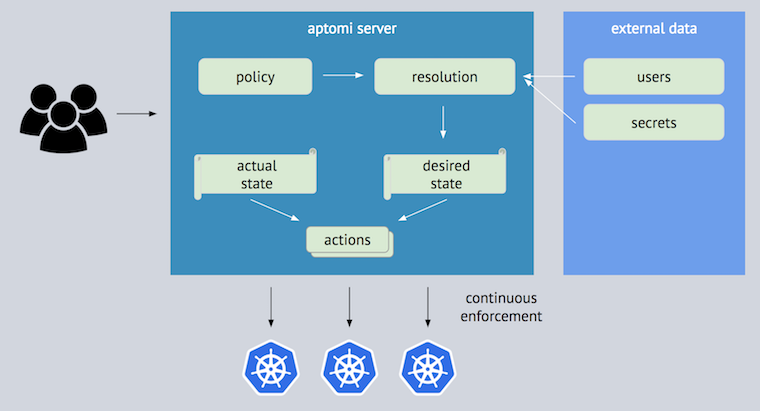
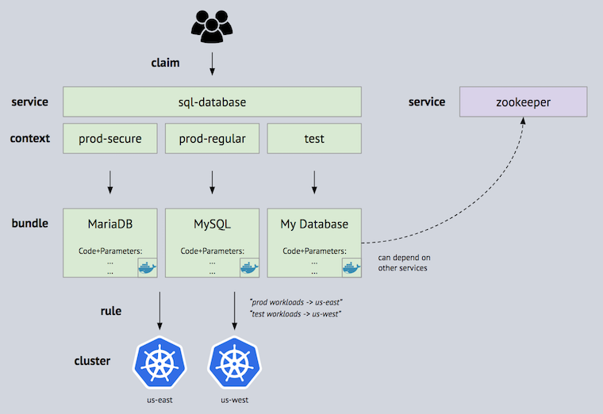

[](https://goreportcard.com/report/github.com/Aptomi/aptomi)
[](https://ci.aptomi.io/job/aptomi%20-%20tests/)
[](https://coveralls.io/github/Aptomi/aptomi)
[](https://godoc.org/github.com/Aptomi/aptomi)
[]()
[](http://slack.aptomi.io)

[Aptomi](http://aptomi.io) simplifies roll-out, operation and control of container-based applications on k8s. It introduces a
service-centric abstraction that allows Dev and Ops to collaborate asynchronously.  It enables teams to create and operate services,
share them across the organization, and fully control their lifecycle. Changes and updates are executed with a goal of minimizing
disruptive impact on depending services.

It is particularly useful in environments with multiple teams, clouds and data centers, where intent-based management
plays an important role in running large application infrastructure. Aptomi’s current focus is Kubernetes, but it's
designed to work with any container runtime and container orchestration technologies.


## Demo

### Asciinema
[](https://asciinema.org/a/k8ZpQTazoSaDV24fiLbG7DfT9?speed=2)

### Youtube (more detailed)
[](http://www.youtube.com/watch?v=HL4RwoBnuTc)

## Table of contents
<!-- START doctoc generated TOC please keep comment here to allow auto update -->
<!-- DON'T EDIT THIS SECTION, INSTEAD RE-RUN doctoc TO UPDATE -->


- [Features & Benefits](#features--benefits)
- [Where Aptomi is located in the stack](#where-aptomi-is-located-in-the-stack)
- [User Guide](#user-guide)
  - [Installation](#installation)
  - [Getting Started](#getting-started)
    - [Configuring LDAP](#configuring-ldap)
    - [Creating k8s Clusters](#creating-k8s-clusters)
    - [Starting Aptomi](#starting-aptomi)
    - [Running Examples](#running-examples)
  - [Architecture & How It Works](#architecture--how-it-works)
    - [Components](#components)
    - [State Enforcement](#state-enforcement)
    - [Language](#language)
- [Dev Guide](#dev-guide)
  - [Building From Source](#building-from-source)
  - [Tests & Code Validation](#tests--code-validation)
  - [Web UI](#web-ui)
  - [How to contribute](#how-to-contribute)
  - [How to release](#how-to-release)
  - [Roadmap](#roadmap)

<!-- END doctoc generated TOC please keep comment here to allow auto update -->

## Features & Benefits
- **Easy way to deploy and manage applications**
  - See [example](examples/twitter-analytics/diagram.png) of a multi-service application for k8s
- **Designed to run on top of any container platform**
  - k8s, OpenShift (with support coming for AWS ECS, GKE, Docker Datacenter, Mesos)
- **Friendly for Dev and Ops**
  - Think applications and services, not infrastructure primitives
  - Keep using your existing application templates (Helm, Ksonnet, k8s YAMLs, etc)
  - Make real-time changes to the running code (change parameters, relocate the whole application w/ dependencies to another cluster, restrict access, etc)
  - Minimizes disruption impact of change on depending services
- **Continuous state enforcement**
  - Desired state of all services is rendered as a system and continuously validated/enforced 
  - Built-in service discovery ensures all dependencies always are up to date    
- **Lazy allocation of resources**
  - Containers are running only when needed (i.e. when someone declared an intent to consume the corresponding service)
- **Flexible rule engine. *See examples of user-defined rules:***
  - *Production Instances* get deployed to *us-west*, *Staging Instances* get deployed to *us-west*
  - *Web* and *Mobile* teams always share the same *small* flavor of *Analytics* service in *Staging*, while 
    *Healthcare* team gets a dedicated *high-performance* instance of the same service
  - *Development* teams can never deploy to *Production*
  - *Personal* development instances of *MyApp* can only be running *from 7am to 11pm* and should be terminated overnight 
    for all developers
- **Insights & Contextual visibility**
  - UI to understand what services are running, why they were instantiated, visualize dependencies and impact of changes. No
    need to deal with thousands of individual containers
     
        
## Where Aptomi is located in the stack
Aptomi sits in between CI/CD and container orchestration. Being in deployment path for applications, it can apply
higher-level policy rules (see examples above) and configure the underlying infrastructure components accordingly. 

 

## User Guide

### Installation
The best way to install Aptomi is to download its latest release, which contains compiled server and client binaries for various platforms:
- Aptomi Server is an all-in-one binary with embedded DB store, which serves API requests, runs UI, as well as does deployment and continuous state enforcement
- Aptomi Client is a client for talking to Aptomi Server. It allows end-users of Aptomi to feed YAML files into Aptomi Server over REST API

You can run those binaries locally.

Additionally you can download binary using `go get -u gopkg.in/Aptomi/aptomi.v0/cmd/aptomictl` command.
Make sure that your `$GOPATH/bin` is in the `$PATH` to use it.
You can rerun this command to update your client.

And finally it's possible just to use dockerized client in a following way:

```bash
# just run docker run directly:
docker run -it --rm -v "$HOME/.aptomi/":"/root/.aptomi" aptomi/aptomictl:0 policy show

# or add alias for it:
alias aptomictl='docker run -it --rm -v "$HOME/.aptomi/":"/root/.aptomi" aptomi/aptomictl:0'

# to update client you'll need to run:
docker pull aptomi/aptomictl:0
```

### Getting Started

#### Configuring LDAP
Aptomi needs to be configured with user data source in order to enable UI login and make policy decisions based on users' labels/properties. It's recommended to
start with LDAP, which is also required by Aptomi examples and smoke tests.

1. LDAP Server with sample users is provided in a docker container. To download and start the published LDAP server image, run:
    ```
    ./tools/demo-ldap.sh
    ```
2. Even though it's not required, you may want to download and install [Apache Directory Studio](http://directory.apache.org/studio/) to familiarize yourself with the user data in provided in sample LDAP server. Once installed,
follow these [step-by-step instructions](http://directory.apache.org/apacheds/basic-ug/1.4.2-changing-admin-password.html) to connect to LDAP and browse it. Use default credentials given in the manual.

#### Creating k8s Clusters
You need to have access to k8s cluster in order to deploy services from the provided examples. Two k8s clusters will enable you to
take full advantage of Aptomi policy engine and use cluster-based rules.
1. If you don't have k8s clusters set up, follow [these instructions](examples/README.md) and run the provided script to create them in Google Cloud.
    ```
    ./tools/demo-gke.sh up
    ```

#### Starting Aptomi
1. Download the latest release of Aptomi from [releases](https://github.com/Aptomi/aptomi/releases).
    It comes with server and client binaries as well as examples directory and needed tools. Unpack it into some directory:
    ```
    export aptomi_version=X.Y.Z
    export aptomi_os=darwin # or linux
    export aptomi_arch=amd64 # or 386
    export aptomi_name=aptomi_${aptomi_version}_${aptomi_os}_${aptomi_arch}

    wget https://github.com/Aptomi/aptomi/releases/download/v${aptomi_version}/${aptomi_name}.tar.gz
    tar xzf ${aptomi_name}.tar.gz
    cd ${aptomi_name}
    ```

1. Create config for Aptomi server and start it. It will serve API and UI :
    ```
    mkdir /var/lib/aptomi
    sudo cp examples/config/server.yaml /var/lib/aptomi/config.yaml
    aptomi server
    ```

1. Create config for Aptomi client and make sure it can connect to the server:
    ```
    mkdir ~/.aptomi
    cp examples/config/client.yaml ~/.aptomi/config.yaml
    aptomictl -u Sam policy show
    ```
    You should be able to see:
    ```
    &{{policy} {1 2017-11-19 00:00:05.613151 -0800 PST aptomi} map[]}
    ```

1. Open Web UI and log in (use 'sam:sam', it's a user from sample LDAP server running locally in a container)
    [http://localhost:27866/](http://localhost:27866/)

#### Running Examples
Once Aptomi is up and running and k8s clusters are set up, you can get started by running the following examples:

Example    | Description  | Diagram
-----------|--------------|--------------
[twitter-analytics](examples/twitter-analytics) | Twitter Analytics Application, multiple components, 2 k8s clusters | [Diagram](examples/twitter-analytics/diagram.png)

More examples are coming.

### Architecture & How It Works

#### Components
 

#### State Enforcement


#### Language


See [language documentation](docs/language.md)

## Dev Guide

### Building From Source
In order to build Aptomi from source you will need Go (the latest 1.9.x) and a couple of external dependencies:
* glide - all Go dependencies for Aptomi are managed via [Glide](https://glide.sh/)
* docker - to run Aptomi in container, as well as to run sample LDAP server with user data
* kubernetes-cli and kubernetes-helm for using Kubernetes with Helm
* npm - to build UI, as well as automatically generate table of contents in README.md 
* telnet, jq - for the script which runs smoke tests

If you are on macOS, install [Homebrew](https://brew.sh/) and [Docker For Mac](https://docs.docker.com/docker-for-mac/install/), then run: 
```
brew install go glide docker kubernetes-cli kubernetes-helm npm telnet jq
```

Check out Aptomi source code from the repo:
```
mkdir -p $GOPATH/src/github.com/Aptomi
cd $GOPATH/src/github.com/Aptomi
git clone https://github.com/Aptomi/aptomi.git
```

In order to build Aptomi, you must first tell Glide to fetch all of its dependencies. It will read the list of
dependencies defined in `glide.lock` and fetch them into a local "vendor" folder. After that, you must run Go to
build and install the binaries. There are convenient Makefile targets for both, run them:
```
make vendor 
make install
```

### Tests & Code Validation

Command    | Action          | LDAP Required
-----------|-----------------|--------------
```make test```    | Unit tests | No
```make alltest``` | Integration + Unit tests | Yes
```make smoke```   | Smoke tests + Integration + Unit tests | Yes
```make profile-engine```   | Profile engine for CPU usage | No
```make coverage```   | Calculate code coverage by unit tests | No
```make coverage-full```   | Calculate code coverage by unit & integration tests | Yes

Command     | Action          | Description
------------|-----------------|--------------
```make fmt```  | Re-format code | Re-formats all code according to Go standards
```make lint``` | Examine code | Run linters to examine Go source code and reports suspicious constructs

### Web UI
Source code is available in [webui](webui)

Make sure you have latest `node` and `npm`. We have tested with node v8.9.1 and npm 5.5.1 and it's
known to work with these.

Command     | Action
------------|----------
```npm install```  | Install dependencies
```npm run dev``` | Serve with hot reload at localhost:8080
```npm run build``` | Build for production with minification
```npm run build --report``` | Build for production and view the bundle analyzer report
```npm run unit``` | Run unit tests: *coming soon*
```npm run e2e``` | Run e2e tests: *coming soon*
```npm run test``` | Run all tests: *coming soon*

### How to contribute
Report a bug. Send us a pull request.

List of areas where we could use help:
- Feedback from Dev & Ops teams on service & rule definitions
- Adding support for additional cloud providers (AWS ECS, GKE, Docker Datacenter, Mesos)
- Also, see [Feature Backlog](https://github.com/Aptomi/aptomi/milestone/11)

### How to release
Use `git tag` and `make release` for creating new release.

1. Create annotated git tag and push it to github repo. Use commit message like `Aptomi v0.1.2`.

```
git tag -a v0.1.2
git push origin v0.1.2
```

1. Create GitHub API token with the `repo` scope selected to upload artifacts to GitHub release page. You can create
one [here](https://github.com/settings/tokens/new). This token should be added to the environment variables as `GITHUB_TOKEN`.

1. Run `make release`. It'll create everything needed and upload all artifacts to github.

1. Go to https://github.com/Aptomi/aptomi/releases/tag/v0.1.2 and fix changelog / description if needed.

### Roadmap
We will soon publish the list of items for Q4 2017 and Q1 2018. In the meantime,
[Feature Backlog](https://github.com/Aptomi/aptomi/milestone/11) is a good place to look at the roadmap items
which are being considered.

If you have any questions, please contact us on [](http://slack.aptomi.io).
