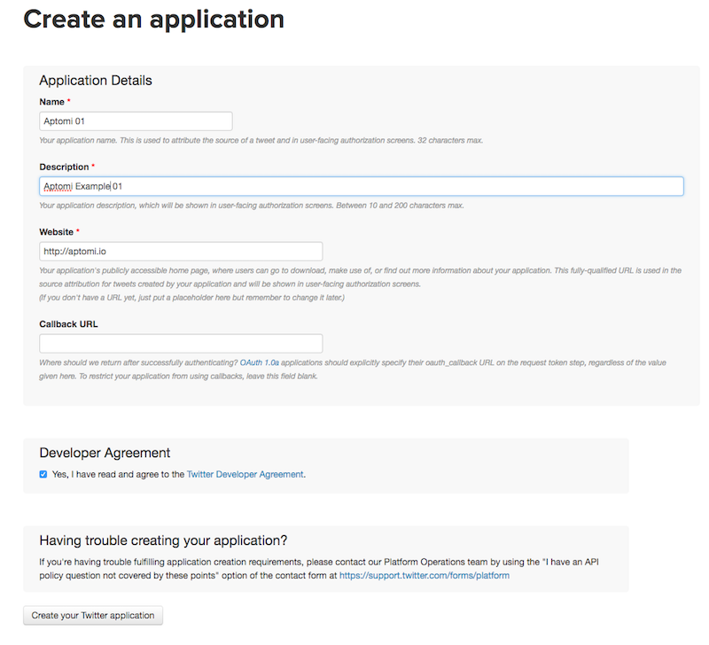

# Description

In this example there are 2 main services:
- `analytics_pipeline` - it consists of kafka, spark, hdfs, zookeeper and is offered in two different contexts
  - *stage*: in sharing all consumers of analytics_pipeline get to share the same instance
  - *production*: a single production instance with more memory, better replicas count, etc 
- `twitter_stats` - it depends on `analytics_pipeline` and consists of 3 components (publisher, stats, ui)
  - it gets data from Twitter in real time, calculates top hashtags using an external service and displays results on a web page


These services have different owners, who can fully control how their services get offered and shared:

User  | Role |
------|-------
Sam   | Domain admin for Aptomi
Frank | Owner of `analytics_pipeline`
John  | Owner of `twitter_stats`
Alice, Bob, Carol | Users and code contributors to `twitter_stats`

This example illustrates a few important things that Aptomi does:

1. **Service-based approach to run applications**
    - Service owners publish their services and fully define how they get offered & shared to others
    - Implementation details are abstracted away from consumers, so they can consume other services without knowing the inner-workings
1. **Service update**
    - Change label with a single command and re-apply only the required delta
1. **Service reuse**
    - Alice and Bob share the same instance of analytics_pipeline in staging
1. **Policy & rules**
    - Different people have different access rights in Aptomi
    - Aptomi can instantiate services with different parameters in different clusters (based on a certain criteria, e.g. even consumer identity)

# Instructions

1. Generate YAMLs for your k8s clusters. This assumes that you have `cluster-us-east` and `cluster-us-west` contexts defined in kubectl (see `kubectl config get-contexts`).
    ```
    aptomictl gen cluster -c cluster-us-east >~/.aptomi/examples/twitter-analytics/policy/Sam/cluster-us-east.yaml
    aptomictl gen cluster -c cluster-us-west >~/.aptomi/examples/twitter-analytics/policy/Sam/cluster-us-west.yaml
    ```
 
1. Upload the list of clusters, user roles and rules into Aptomi using CLI:
    ```
    aptomictl policy apply --username Sam -f aptomictl policy apply --username Sam -f ~/.aptomi/examples/twitter-analytics/policy/Sam
    ```

1. Import `analytics_pipeline` and `twitter_stats` services  
    ```
    aptomictl policy apply --username Frank -f ~/.aptomi/examples/twitter-analytics/policy/Frank
    aptomictl policy apply --username John -f ~/.aptomi/examples/twitter-analytics/policy/John
    ```
1. At this point all service definition have been published to Aptomi, but nothing has been instantiated yet. You can see
that in Aptomi UI under [Policy Browser](http://localhost:27866/#/policy/browse)

1. Request production instance of `twitter-stats`, as well as two development instances in staging:
    ```
    aptomictl policy apply --wait --username John -f ~/.aptomi/examples/twitter-analytics/policy/john-prod-ts.yaml
    aptomictl policy apply --wait --username Alice -f ~/.aptomi/examples/twitter-analytics/policy/alice-stage-ts.yaml
    aptomictl policy apply --wait --username Bob -f ~/.aptomi/examples/twitter-analytics/policy/bob-stage-ts.yaml
    aptomictl policy apply --wait --username Carol -f ~/.aptomi/examples/twitter-analytics/policy/carol-stage-ts.yaml
    ```
    
    You can see that:
    * Aptomi is allocating production instance for John in `cluster-us-east` (per [rules.yaml](policy/Sam/rules.yaml))
    * Aptomi is allocating staging instances for Alice & Bob in `cluster-us-west` (per [rules.yaml](policy/Sam/rules.yaml))
    * Aptomi is not allocating an instance for Carol, as users from 'mobile-dev' are not allowed to consume services (per [rules.yaml](policy/Sam/rules.yaml))
    * [Policy Browser](http://localhost:27866/#/policy/browse) -> Desired State: `analytics pipeline` is shared by both Alice and Bob in staging
    * [Instances](http://localhost:27866/#/policy/dependencies): you can retrieve endpoints for all deployed services

    To check deployment progress, you can run the following command and wait for "1/1" status for pods:
    ```
    watch -n1 -d -- kubectl --context cluster-us-east -n demo get pods
    watch -n1 -d -- kubectl --context cluster-us-west -n demo get pods
    ```

1. If everything got deployed successfully, you should be able to see:
   - running *production* instance of twitter stats in `cluster-us-east` (managed by John)
   - running *staging* instance of twitter stats in `cluster-us-west` (Alice's version with new look & feel)
   - running *staging* instance of twitter stats in `cluster-us-west` (Bob's version)

# Enabling Streaming Data from Twitter

1. Now, we need to provide user secrets, so twitter_stats component can pull data over Twitter Streaming API. Create 3
applications in [Twitter Application Management Console](https://apps.twitter.com)
    
    
    Generate keys and access tokens for them:
    
    
    Once done, copy secrets.yaml and enter the created keys/tokens into it:
   ```
   cp examples/twitter-analytics/_external/secrets/secrets.yaml.template /etc/aptomi/secrets.yaml
   vi /etc/aptomi/secrets.yaml
   ```

If you open tweeviz HTTP endpoints, you will be able to see tweets coming in real-time over Twitter Streaming API, getting processed through analytics-pipeline, and displayed on the web.

