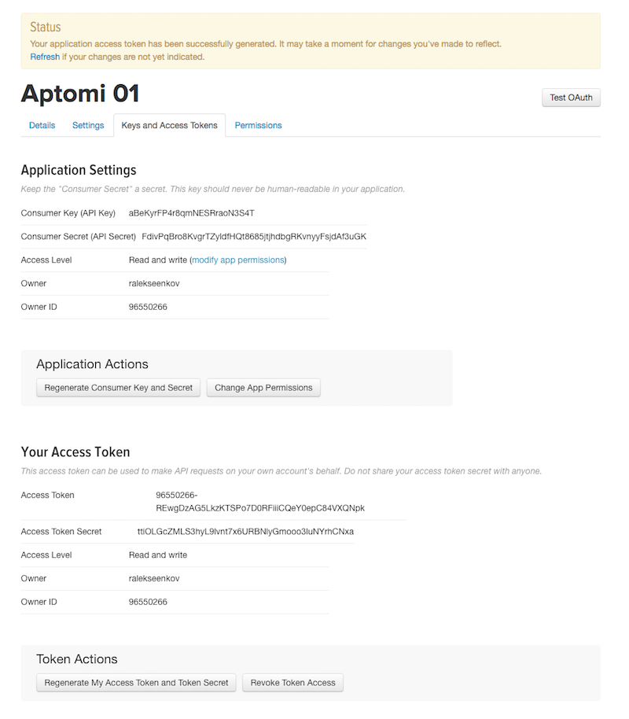

# Description

In this example there are two key services:
* `analytics_pipeline` - A data analytics service which consists of Kafka, Spark, HDFS, and Zookeeper.
* `twitter_stats` -  A Twitter data processing service, which gets messages from Twitter in real time, calculates top hashtag statistics using an external `analytics_pipeline` service,
   and displays results on a web page.

Deployment of those services are managed by Aptomi as follows:
* `analytics_pipeline` is a platform service, which gets deployed in ** as a single instance and gets shared by other services
* `twitter_stats` in offered in *realtime* and *dev* contexts
  * *realtime* is used in production deployments, configured to receive messages via Twitter Streaming API
  * *dev* is used for testing, configured to use mock backend which generates a constant stream of pre-defined messages  
   


These services have different owners, who can fully control how their services get offered and shared:

User  | Role
------|-------
Sam   | Domain admin for Aptomi
Frank | Owner of `analytics_pipeline`
John  | Owner of `twitter_stats`
Alice, Bob, Carol | Developers and users of `twitter_stats`

This example illustrates a few important things that Aptomi does:

1. **Manage deployments of multi-component apps as code**
    * Define an application and its contexts
    * Run them across multiple environments and clusters
    * Update specific parts/components of an application after you deploy
    * Automatically know impact of changes based on the service graph
1. **Service ownership & reuse**
    - Owners define how their services get offered & shared with others
    - Consumers can be directed to use the same service instance
1. **Control**
    - Define who can have access to which services

# Instructions

1. Upload user roles and rules into Aptomi using the CLI, then import the `analytics_pipeline` and `twitter_stats` services:
    ```
    aptomictl login -u sam -p sam
    aptomictl policy apply --wait -f ~/.aptomi/examples/twitter-analytics/policy/rules
    
    aptomictl login -u frank -p frank
    aptomictl policy apply --wait -f ~/.aptomi/examples/twitter-analytics/policy/analytics_pipeline
    
    aptomictl login -u john -p john
    aptomictl policy apply --wait -f ~/.aptomi/examples/twitter-analytics/policy/twitter_stats
    ```

1. At this point, all service definitions have been published to Aptomi, but nothing has been instantiated yet. You can see
this in the Aptomi UI under [Policy Browser](http://localhost:27866/#/policy/browse)

1. Start dev instances of `twitter-stats`, wait until they are up:
    ```
    aptomictl login -u alice -p alice
    aptomictl policy apply --wait -f ~/.aptomi/examples/twitter-analytics/policy/alice-dev-ts.yaml
    
    aptomictl login -u bob -p bob
    aptomictl policy apply --wait -f ~/.aptomi/examples/twitter-analytics/policy/bob-dev-ts.yaml
    ```

    To check your deployment progress, run `kubectl get pods` and wait for "1/1" status for all created pods:
    ```
    watch -n1 -d -- kubectl -n west get pods
    ```

    Note that the first-time deployment will download all Helm charts & container images (1GB+) and cache them in your k8s cluster(s). This can take a while, depending on your internet connection (pods will be in `ContainerCreating` status)
      * k8s on GKE will give you the best experience (5-10 min)
      * running locally on Minikube or Docker For Mac will likely be slower (up to 15-20 min)

    All subsequent runs will be much faster, as the charts and images will already be there.

1. Start production instance of `twitter-stats`:

    ```
    aptomictl login -u john -p john
    aptomictl policy apply --wait -f ~/.aptomi/examples/twitter-analytics/policy/john-prod-ts.yaml
    ```

    To check your deployment progress, run `kubectl get pods`:
    ```
    watch -n1 -d -- kubectl -n east get pods
    ```

    **Important note**: you will need to take an extra step in order to get the *prod* environment fully up and running. Right now `tweepub` and `tweeviz` health checks will be showing "0/1" - this
    is expected, as they can't use the Twitter Streaming API until tokens have been configured. Once you set up tokens in Twitter and pass them
    to Aptomi, those services will start successfully. See the next section on how to configure Twitter keys and pass them to Aptomi.

1. At this point you can see that:
    * Aptomi applied the defined [rules](policy/rules/rules.yaml) and allocated
        * *analytics_pipeline* in `east` namespace
        * *prod* instances of `twitter-stats` in `east` namespace
        * *dev* instances of `twitter-stats` in `west` namespace

    * Aptomi enforced that `analytics pipeline` will be shared by all consumers. See [Policy Browser](http://localhost:27866/#/policy/browse) -> Desired State

    * Endpoints of the deployed services are available under [Claims](http://localhost:27866/#/objects/claims) in Aptomi UI
        * `tweeviz` available in *alice_dev* and *bob_dev* over HTTP with fake Twitter data source
        * `tweeviz` available in *prod* over HTTP with real-time Twitter data (assuming you have followed the step to configure Twitter tokens)

# Advanced: Enabling Streaming Data from Twitter

If you want a truly fully functional demo, you can actually inject Twitter App Tokens into the *prod* instance of `twitter_stats`, so it can start pulling data from the Twitter Streaming API!

First, create an application in the [Twitter Application Management Console](https://apps.twitter.com) 

Next, generate keys and access tokens for it:
    

Once done, upload the updated *production* claim with Twitter tokens into Aptomi:

```
    cp ~/.aptomi/examples/twitter-analytics/policy/john-prod-{ts.yaml,ts-changed.yaml}
    vi ~/.aptomi/examples/twitter-analytics/policy/john-prod-ts-changed.yaml
    aptomictl login -u john -p john
    aptomictl policy apply --wait -f ~/.aptomi/examples/twitter-analytics/policy/john-prod-ts-changed.yaml
```
Now, if you open the HTTP endpoint for the *production* instance of `tweeviz`, you will be able to see hashtag statistics calculated from real-time messages retrieved via the Twitter Streaming API.

# Terminating all deployed services

To delete all deployed instances of `twitter_stats` and `analytics_pipeline`, you must delete the corresponding claims which triggered their instantiation. Aptomi will handle the rest:
```
aptomictl login -u alice -p alice
aptomictl policy delete --wait -f ~/.aptomi/examples/twitter-analytics/policy/alice-dev-ts.yaml
aptomictl login -u bob -p bob
aptomictl policy delete --wait -f ~/.aptomi/examples/twitter-analytics/policy/bob-dev-ts.yaml
aptomictl login -u john -p john
aptomictl policy delete --wait -f ~/.aptomi/examples/twitter-analytics/policy/john-prod-ts.yaml
```

Alternatively, you can do this manually via `kubectl`:
```
kubectl delete ns west
kubectl delete ns east
```
